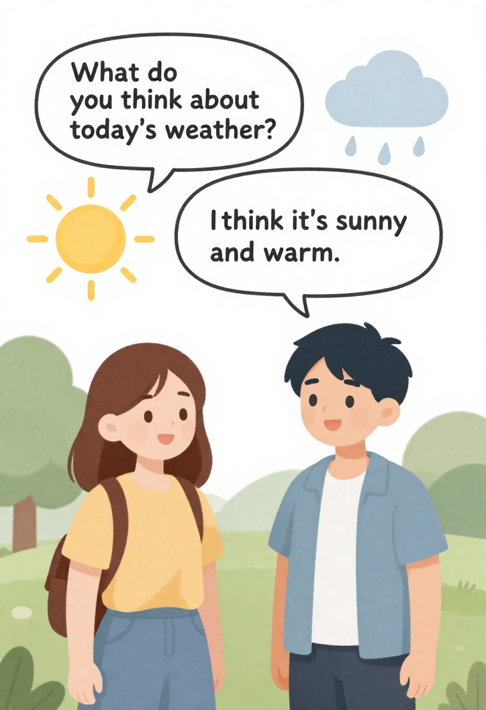
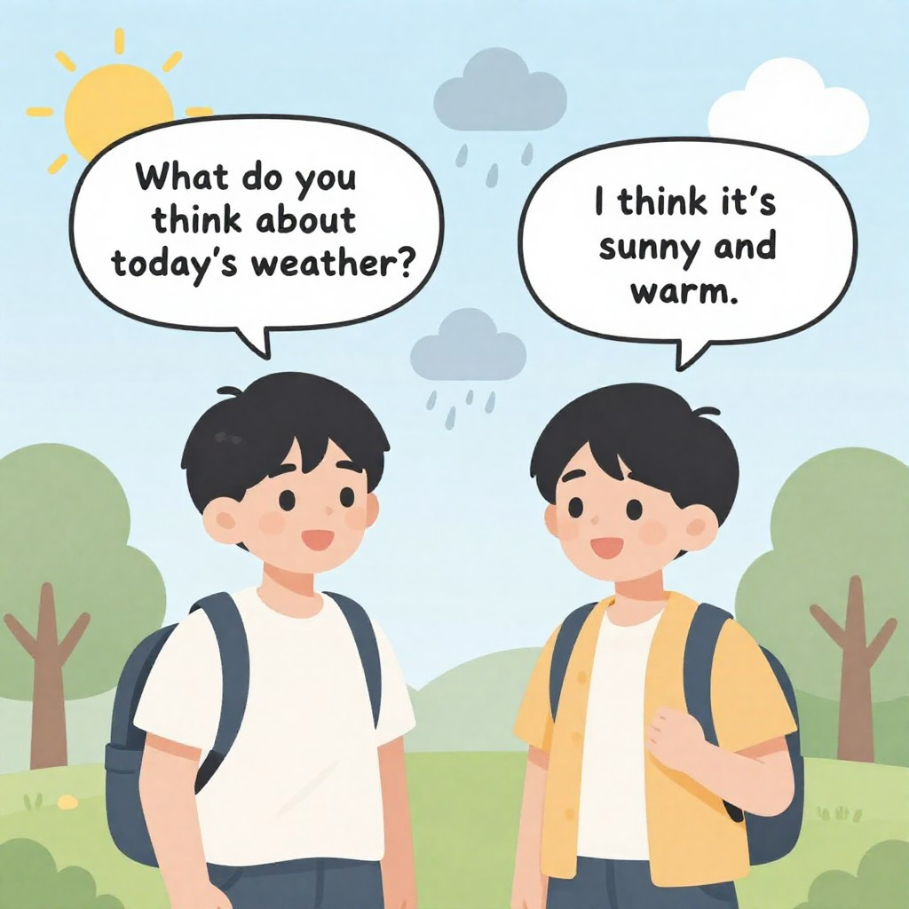
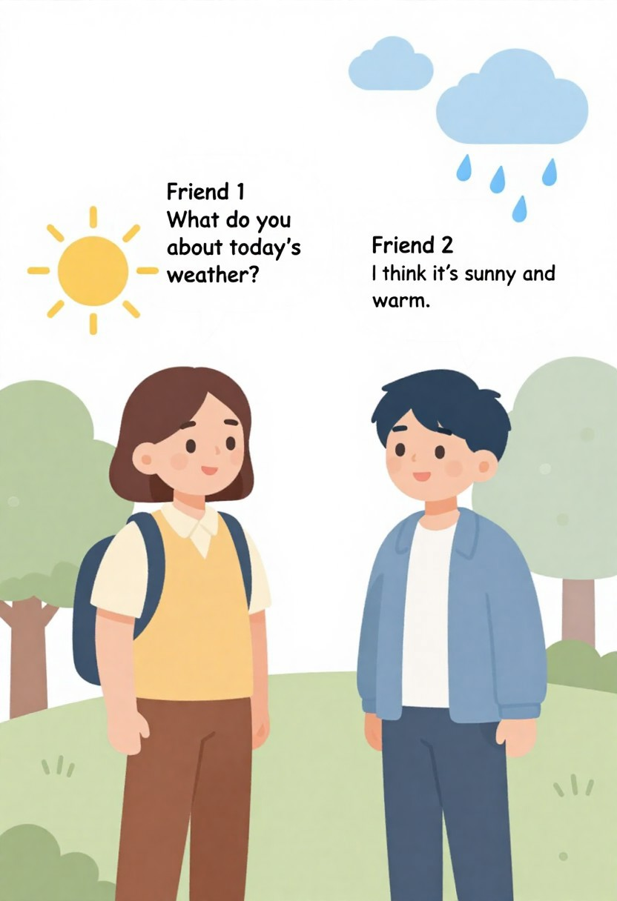

# Task-2 — Image Tool Research

## Amaç: 
Bu görev, farklı image-generation araçlarını (CivitAI, DreamStudio, Kandinsky 2.2, SDXL) LGS tarzı eğitim görselleri üretimi bağlamında değerlendirmek; her aracın güçlü/zaaf yönlerini, üretim kanallarını ve en başarılı çıktıları tespit etmektir.

### Ne yapıldı:
- Ekip tarafından hazırlanan per-tool raporlar ve SWOT analizleri birleştirildi.
- Standart bir LGS PoC prompt’u (iki arkadaş diyaloglu, konuşma balonları) kullanılarak her araç için örnek çıktılar üretildi ve `images/` klasörüne kaydedildi.
- Çıktılar görsel kalite, konuşma balonu metin okunurluğu, lisans uygunluğu ve programatik kullanılabilirlik açısından karşılaştırıldı.

### Elde Edilen Sonuçlar (kısa):
- Birincil öneri — CivitAI (Zimage): CivitAI üzerinde test edilen `Zimage` modeli LGS tarzı, ders kitaplarına uygun ve en başarılı görsel sonuçları verdi; bu yüzden üretim referansı olarak önerilmektedir.
- İkincil/yardımcı araç — DreamStudio: Yüksek kaliteli refinements, inpainting ve upscaling için uygundur; insan-onaylı, baskı-düzeyi çıktılar gerektiğinde kullanılır.
- Yardımcı/koşullu seçenek — SDXL: Lokal, tekrarlanabilir boru hattı için yardımcı motor olarak tutulabilir ancak bu değerlendirmede bazı örnek çıktılar diğerlerine göre daha az tutarlı bulundu.
- Lisans-safe fallback — Kandinsky 2.2: Apache-2.0 lisansı nedeniyle lisans açısından temiz bir alternatif olarak değerlendirilmelidir; ancak topluluk LoRA desteği sınırlıdır ve ek çalışma gerektirir.

### Görsel Örnekler (repo içi, sanitized):
- CivitAI (Zimage) örnekleri:

- DreamStudio örnekleri:

- SDXL örneği:

- Kandinsky örneği:

### Kısa Değerlendirme Notları:
- Görsel kalite ve LGS stil uygunluğu açısından `Zimage` örnekleri en iyi dengeyi gösterdi; özellikle karakterlerin stilizasyonu ve kompozisyon başarılı bulundu.
- Konuşma balonu içindeki metinler tüm araçlarda doğrudan güvenilmez sonuç verdi; kesin metin ihtiyacı varsa üretim sonrası deterministik overlay (vector/text) adımı önerilir.
- Programatik üretim için CivitAI kütüphanesinden indirilen ağırlıkların lokal olarak merge edilip pinlenmesi, tam reproducibility için izlenmesi gereken yol olarak öne çıkmıştır.

### Sonuç / Öneri (kısa):
- Bu Task sonucunda LGS Image Generation için referans/ilk tercih olarak **CivitAI (Zimage)** belirlenmiştir. DreamStudio refinements için ikincil olarak kullanılmalı; SDXL sadece yardımcı/alternatif motor olarak tutulmalıdır; Kandinsky lisans avantajı nedeniyle deneysel/fallback seçenek olarak saklanmalıdır.
