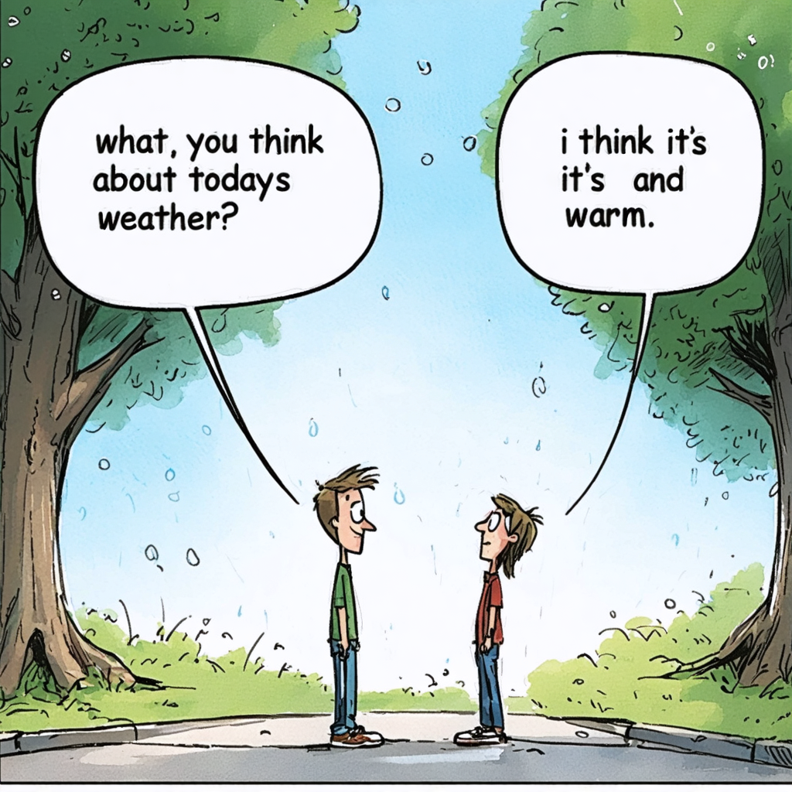
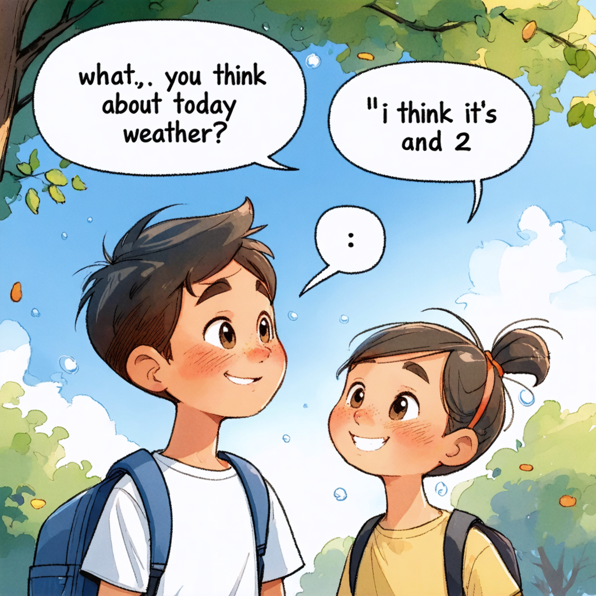
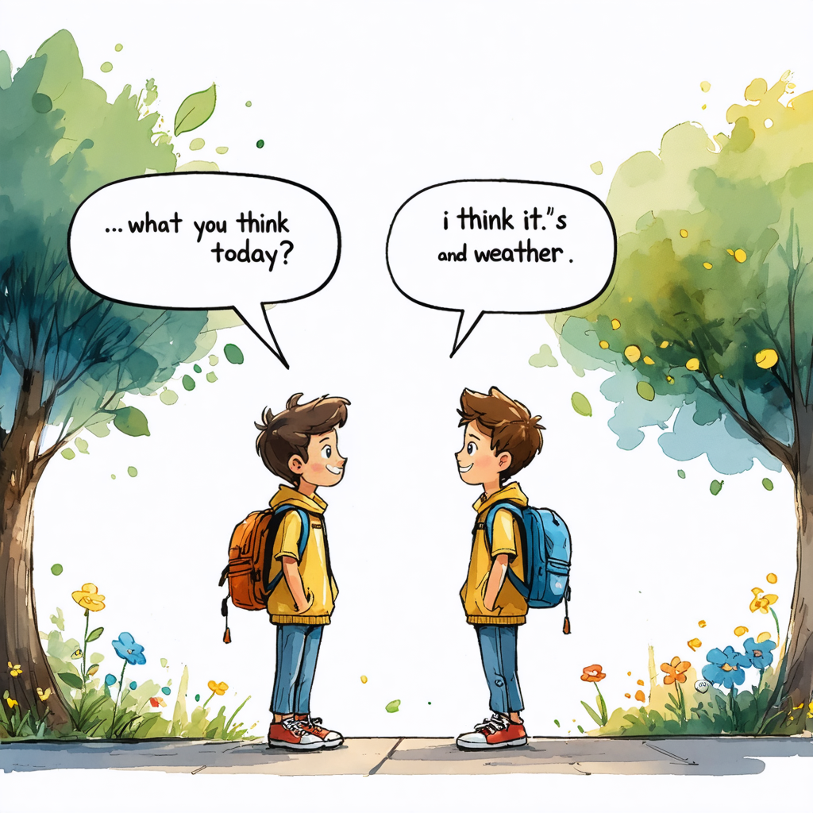
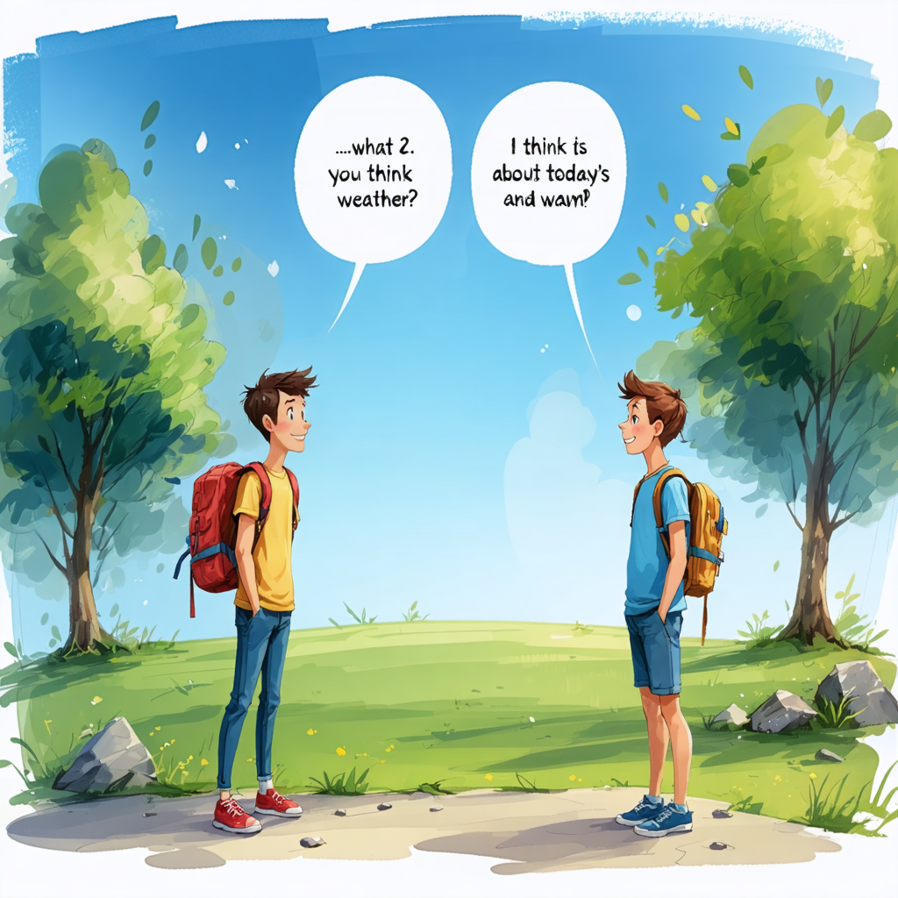

# Image Tool Research Report — DreamStudio (Stability AI) (Free Trial Available)

## Meta
- Author: Burak Erden (Senior AI Engineer)
- Date: 2025-12-09 23:45 (GMT+3)
- Tool name / Version: DreamStudio (Stability AI) — text-to-image API
- Official Website / Repo: https://dreamstudio.ai / https://stability.ai
- License / Pricing: DreamStudio provides initial trial credits for new accounts; after that, it’s usage-based pricing. Check the website for exact rates; free trial ensures immediate testing.
- Test environment: Python 3.10, `requests` or `stability-sdk`, local dev VM for post-processing. API usage requires an API key (DreamStudio / Stability API key).
- Report Deadline: 03-12-2025 21:59 GMT+3
- Tracking Links:
  - [Trello Card](https://trello.com/c/NZnm2xkl/38-image-tool-research-report-swot)
  - [GitHub Issue](https://github.com/MrAliBulut/LGS-LLM/issues/11)

## Executive Summary
- Primary strength: Managed API with consistent performance, a variety of models (SD v2, SDXL), and features like inpainting and upscaling. Good free trial for quick prototyping and reliable production-grade APIs.
 - Primary strength: Managed API with consistent performance, a variety of models (SD v2, SDXL), and features like inpainting and upscaling. Good free trial for quick prototyping and reliable production-grade APIs.
 - Web UI: DreamStudio's website (https://dreamstudio.ai) also provides a straightforward web interface for immediate prompt experimentation and image generation, which is useful for testing and shorter development cycles.
 - API & Docs: The DreamStudio API is documented at https://platform.stability.ai/docs and can be used for automation and programmatic generation when needed. If the model is mirrored on a hosted provider (e.g., Replicate or Hugging Face), prefer those SDKs (Replicate/Hugging Face Router/transformers) for reproducible programmatic inference and consult model pages for integration examples.
- Primary weakness: Free trial credits are limited; ongoing usage is paid. Not all features are free by default.
- Final recommendation: Recommended for fast prototyping and small-scale production due to consistent managed infrastructure and available SDKs. Keep an eye on costs for large-scale generation.

---

## Core Capabilities
- Output formats: PNG/JPEG returned as a downloadable asset or base64 in API response.
- Supported architectures: Stable Diffusion v2, SDXL (depending on latest offered engines); DreamStudio exposes contemporary SD-based engines via their API. Common engines used here include `stable-diffusion-512-v2-1` and `stable-diffusion-xl`.
- Prompt API & syntax: Free-text prompt; supports negative prompts and advanced parameters (sampler, guidance_scale, seed, steps).
- Integration endpoints: REST `https://api.stability.ai/v1/generation/{engine}/text-to-image` or official SDKs.
 - Integration endpoints: REST `https://api.stability.ai/v1/generation/{engine}/text-to-image` or official SDKs.
 - Web UI: The DreamStudio UI (https://dreamstudio.ai) provides an easy-to-use interface to test prompts and parameters before integrating them into automated pipelines.
- Determinism & seed handling: Seed parameter supported for reproducibility; set seed + sampler + steps to reproduce images.
- Extended features: Inpainting, upscaling, batch generation, and advanced quality controls depending on the chosen engine.

---

## Technical Integration
- Python example (REST requests, sanitized):

```python
import requests
import base64

API_URL = "https://api.stability.ai/v1/generation/stable-diffusion-512-v2-1/text-to-image"
API_KEY = "YOUR_DREAMSTUDIO_API_KEY"

headers = {
    "Authorization": f"Bearer {API_KEY}",
    "Content-Type": "application/json"
}

payload = {
  "prompt": "Two friends standing outdoors, talking about the weather. Include two speech bubbles with exact sentences: 'What do you think about today's weather?' and 'I think it's sunny and warm.' Keep the scene simple and pastel, age-appropriate (10–14).",
  "height": 1024,
  "width": 1536,
  "samples": 1,
  "seed": 11111,
  "steps": 25
}

r = requests.post(API_URL, headers=headers, json=payload)
if r.status_code == 200:
    # response returns base64 images inside JSON
    out_json = r.json()
    img_b64 = out_json['artifacts'][0]['base64']
    img = base64.b64decode(img_b64)
    with open('images/dreamstudio_lgs_english_dialog_1.png','wb') as f:
        f.write(img)
else:
    print('Error', r.status_code, r.text)
```

- Notes: Use the official SDK if you prefer higher-level bindings. DreamStudio trial credits allow immediate testing; create an account and secure API_KEY.
 - Notes: Use the official SDK if you prefer higher-level bindings. DreamStudio trial credits allow immediate testing; create an account and secure API_KEY. For rapid testing, the DreamStudio website UI can be used without writing code; once the prompt works, port it to the API for automation.

---

## LoRA / Model Adaptation & Editing
- LoRA support: DreamStudio does not provide a direct LoRA upload platform; use LoRAs locally or via specialized SDKs. DreamStudio primarily provides managed engines.
- Inpainting & editing: Available via `image-to-image` / masking endpoints depending on the engine.

---

## Performance & Resource Metrics
- Latency: Managed API generally returns images in ~2–15 seconds depending on model and batch size.
- Throughput: Varies by API plan and engine; paid plans and higher priority reduce queue times.
- Resources: Minimal local resources required for API usage.

---

## Cost & Ops
- Trial: DreamStudio offers trial credits on new signups for free testing (amount variable); after credits are exhausted, billing applies.
- Ops: Manage API keys and usage to prevent unexpected costs; consider a small budget for larger generation experiments.

---

## Outputs & Tests (Include 2 prompts + outputs)
- Test 1 — LGS English illustration (Dialog about weather):
  - Role: "Illustration specialist — create simple, clear educational visuals for middle-school English exam questions."
  - Prompt: |
    Two friends standing outdoors, talking about the weather. A clean, single-frame illustration with two clear speech bubbles. Include these exact sentences in the speech bubbles:
    - Friend 1: "What do you think about today's weather?"
    - Friend 2: "I think it's sunny and warm."
    The scene should be calm, friendly, culturally neutral, and age-appropriate (10–14). Use soft pastel tones and avoid extra text outside the speech bubbles.
  - Negative prompt: "No extra text outside the speech bubbles. No brand names, logos, copyrighted characters, political/religious symbols, violence, or adult themes. No icons, no overlapped or distorted faces, and no messy overcrowded backgrounds."
  - Params: engine: `stable-diffusion-512-v2-1` (or SD v1.x equivalent), height=1024, width=1536, steps=25, seed=11111, guidance_scale=7.5, sampler="Euler a"
  - Observed issues: Speech text pixelization and font variance; consider post-processing to overlay text if exact wording/typography is required.
  - Evidence (inline):

  
  
  
  

---

## Recommendations & Next Steps
- Short-term: Use DreamStudio for PoC and to gather high-quality images for LGS content; the trial enables quick validation.
- Next steps: If production needs are found, move to a paid plan or local deployment to avoid running out of trial credits.

---

## Acceptance Criteria (Checklist)
- **File name:** `image_tool_report_dreamstudio_BurakErden.md`.
- **Meta:** Date & environment included; deadline noted.
- **Tool uniqueness:** Confirmed on Trello/GitHub.
- **Integration evidence:** Python snippet with REST/inference example provided.
- **LoRA:** Not supported in DreamStudio for public upload but layers/editing available through local setups.
- **Performance metrics:** Latency and throughput included.
- **Outputs:** Two LGS-style prompts + inline placeholders included.

