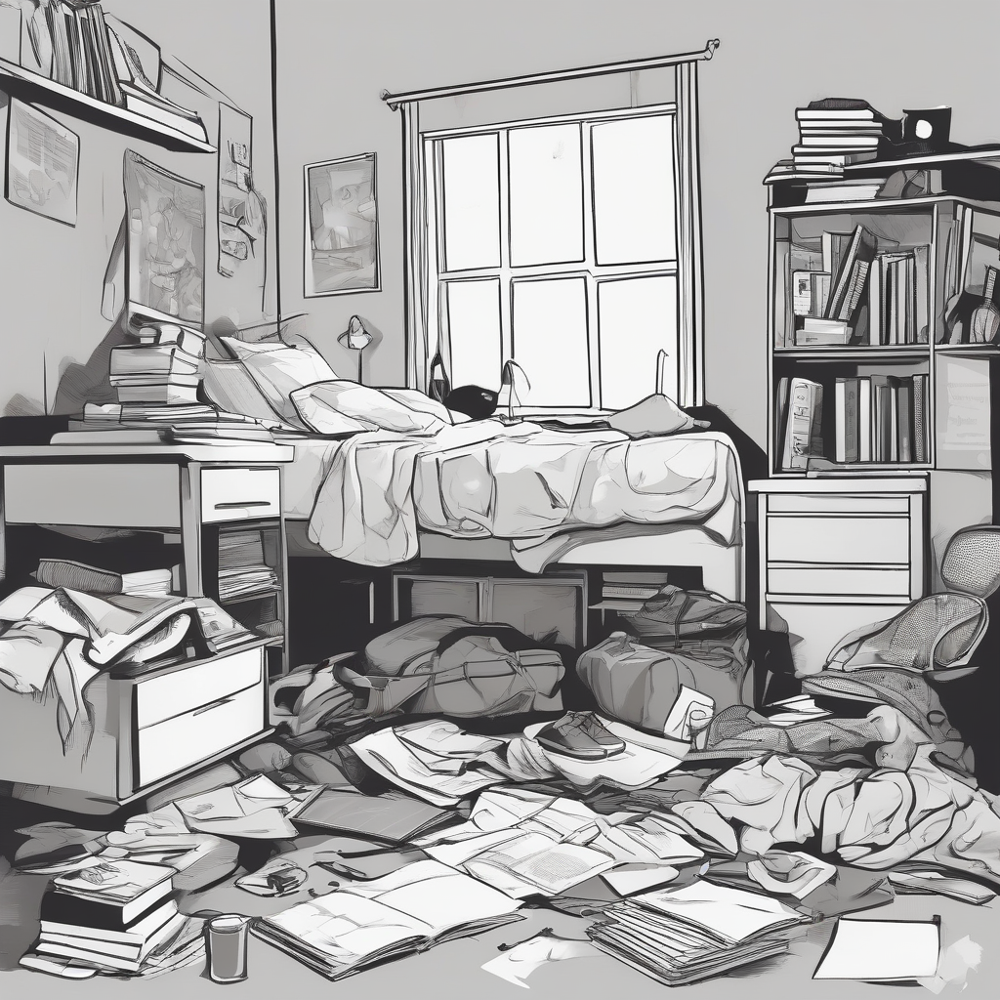

## Meta
- Author: Emirhan
- Date: 2025-12-03 21:00 GMT+3
- Tool name / Version: Stable Diffusion XL (SDXL) Base 1.0
- Official Website / Repo: https://github.com/Stability-AI/generative-models
- License / Pricing: CreativeML Open RAIL++-M (Ticari kullanım ve modifikasyon serbest)
- Test environment: Google Colab (T4 GPU - 15GB VRAM), Python 3.10, Diffusers Library
- Submission file name: `image_tool_report_sdxl_Emirhan.md`
- Report Deadline: 03-12-2025 21:59 GMT+3
- Tracking Links:
    - [Trello Card](https://trello.com/c/NZnm2xkl/38-image-tool-research-report-swot)
    - [GitHub Issue](https://github.com/MrAliBulut/LGS-LLM/issues/11)

## Executive Summary
LGS-LLM projesi kapsamında yapılan Ar-Ge testlerinde; Flux.1 ve SD 3.5 gibi yeni nesil modellerin standart donanımlarda (T4 GPU) bellek darboğazı (OOM) yarattığı tespit edilmiştir. Bu nedenle, üretim hattının sürekliliği ve maliyet etkinliği için **Stable Diffusion XL (SDXL)** ana araç olarak seçilmiştir. SDXL, LGS İngilizce ve Fen soruları için gereken "Vektörel Çizim" kalitesini, donanımı zorlamadan yüksek çözünürlükte (1024px) sunabilmektedir.
- **Primary strengths:** Donanım dostu olması ve LGS sınav tarzına uygun LoRA (ince ayar) ekosisteminin genişliği.
- **Primary weaknesses:** Görsel içi metin yazma (typography) konusunda Flux kadar başarılı değildir.
- **Final recommendation:** Recommend (Önerilir). Pilot üretim için en güvenilir ve hızlı çözümdür.

## Core Capabilities
- **Output formats:** PNG, JPG (Native 1024x1024).
- **Supported architectures:** Latent Diffusion Model (UNet based), 2.6 Milyar parametre.
- **Prompt API:** Çift metin kodlayıcı (CLIP G & L) sayesinde "dağınık oda, kitaplar masada" gibi kompozisyonel promptları iyi anlar.
- **Integration endpoints:** `StableDiffusionXLPipeline` kütüphanesi ile Python üzerinden kolayca yönetilir.
- **Determinism:** Seed sabitleme ile aynı sınav sorusu görseli tekrar üretilebilir.

## Technical Integration
LGS İngilizce sorusu ("Chores" ünitesi) için Python entegrasyonu:

```python
import torch
from diffusers import StableDiffusionXLPipeline

# Load Pipeline (T4 GPU Optimize Edilmiş)
pipe = StableDiffusionXLPipeline.from_pretrained(
    "stabilityai/stable-diffusion-xl-base-1.0",
    torch_dtype=torch.float16,
    use_safetensors=True,
    variant="fp16"
)
pipe.to("cuda")

# LGS English Prompt: Messy Room
prompt = "A clean educational vector illustration for an English exam question showing a messy teenager's room, clothes on the floor, unmade bed, books on the desk, flat design, black and white line art, white background, high contrast"

# Generate Image
image = pipe(
    prompt=prompt,
    num_inference_steps=25,
    generator=torch.Generator("cuda").manual_seed(42)
).images[0]

image.save("sdxl_english.png")image_tool_report_sdxl_Emirhan
```

## Output Examples
 